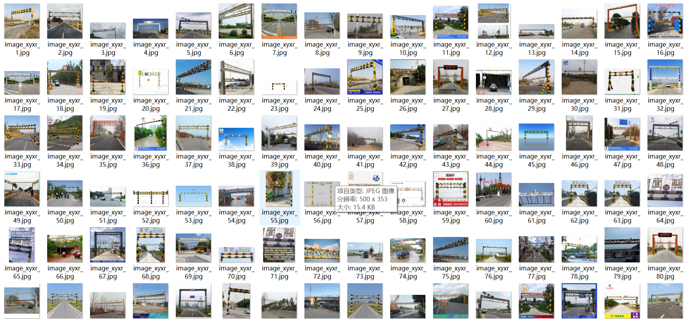
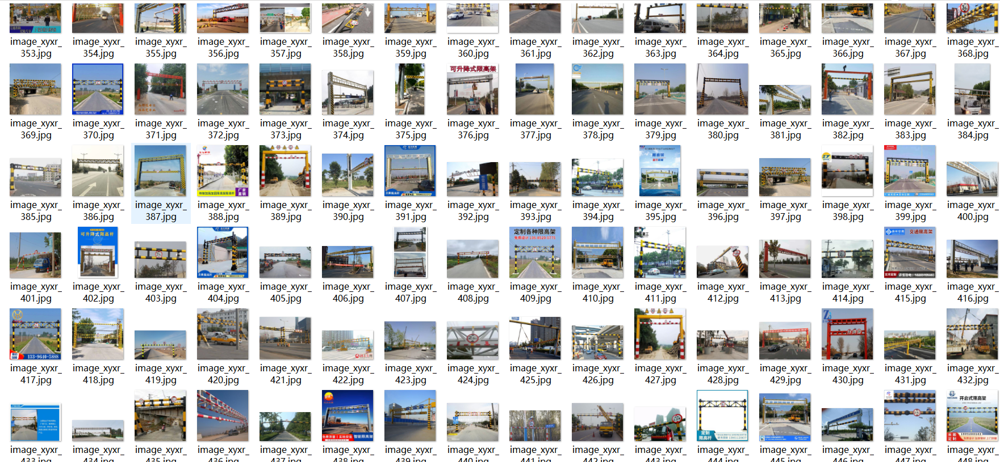

# [Object Detection] Road Height limiting pole Height limiting rack Detection Dataset 834 imagesVOC+YOLO format

Dataset Description: ~

Dataset format: Pascal VOC format + YOLO format (the txt file does not contain the split path, it only contains jpg images and corresponding VOC format xml files and yolo format txt files)

Number of images (number of jpg files): 834

Number of annotations (number of xml files): 834

Number of annotations (number of txt files): 834

Number of categories: 1

Annotation class names: ["height limit pole"]

Number of boxes labeled in each category:

height limit pole frame count = 870

Total boxes: 870

Use the labeling tool: labelImg

## Images

---

Here is a pay link on Stripe (https://buy.stripe.com/3cs8yP7sY87d0vu9AB). Please contact me lonlonago@foxmail.com after funding $89, and I will send you a complete data files, thank you!

